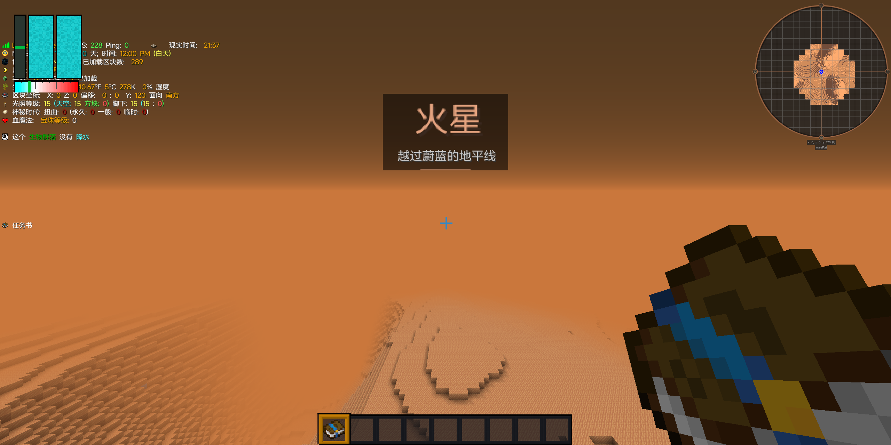

# Traveler's Titles GTNH

A configurable **client-side** Minecraft 1.7.10 Forge mod inspired by Traveler's Titles.
Designed for GT New Horizons 2.9.0-beta-3, including Galacticraft, GalaxySpace, AmunRa,
Ross128, dynamic space stations, Personal Space and extended biome IDs.

## 安装 / Installation

将正常构建生成的 `travelerstitlesgtnh-0.1.0.jar` 放入客户端 `mods` 文件夹。
服务器无需安装；不修改世界生成、维度或群系注册。

Put the normal build JAR in the **client** mods directory. The server does not need it.
Forge is the only required runtime dependency. Space integrations are optional.

## 功能

- 进入维度、行星或新群系时显示淡入淡出标题；维度提示优先。
- 群系边界防抖、最近访问缓存、冷却和最新候选合并。
- 中文/英文基础翻译，以及其他模组名称的运行时回退。
- 资源包文字、颜色、PNG 标题/背景/图标、声音和动画设置。
- Forge 配置界面、客户端预览/重载/诊断命令。
- 读取实际运行时身份，不依赖整合包的固定维度 ID，不把群系 ID 限定为 0–255。

## Configuration

Open **Mods → Traveler's Titles GTNH → Config** for behavior and volume settings.

- `config/travelerstitlesgtnh/general.cfg`: behavior, cooldown, HUD visibility, volume.
- `config/travelerstitlesgtnh/overrides.json`: per-region names and styles, explicit local overrides.
- `/ttgtnh preview dimension` or `/ttgtnh preview biome`: preview the current location after closing chat.
- `/ttgtnh reload`: reload configuration and title resources.
- `/ttgtnh toggle`: persistent on/off toggle.
- `/ttgtnh inspect`: current identifiers and matching rule provenance.
- `/ttgtnh dump`: runtime biome/celestial-body catalogue in the config directory.

All commands run locally and require no server operator permission.
F3+T reloads resources. Behavior settings deliberately remain under the player's control.

See [resource pack and configuration guide](docs/resource-packs.md) and the installable example under
`examples/resourcepack`. Modern-version Traveler's Titles font/JSON packs need conversion;
this mod does not backport the modern font engine.

## Build and test

```powershell
.\gradlew.bat test build
```

The wrapper pins Gradle 9.4.0 and GTNH convention 2.0.29. The resulting normal JAR targets Java 8 bytecode.
Gradle provisions its required Java toolchains. A newer supported JDK is needed to launch Gradle.
Network access is needed on a fresh build to retrieve dependencies.

`build/libs/*-dev.jar` is for development; `*-sources.jar` contains source; the JAR without a classifier is for installation.
`src/qa/java` contains an opt-in integration probe, compiled **only** with `-Pqa`. Never install this QA build
in a normal instance. It requires a `.ttgtnh-qa` marker in a disposable game directory and creates its own creative world.

```powershell
.\gradlew.bat -Pqa test build
```

The QA probe visits registered test dimensions and takes screenshots. Its teleports bypass normal progression,
so it verifies HUD identity/rendering rather than rocket or portal gameplay. See [test report](docs/test-report.md).

After a normal build, `python scripts/verify-artifact.py` checks Java 8 bytecode and absence of the QA probe.
When switching between QA and normal builds, use `clean test build`. If Windows reports a locked build JAR,
run `gradlew --stop` before retrying. Install exactly one build of this mod in each instance.



No release or publishing workflow is included. This repository is intended for private source synchronization.

## License

MIT for this independent implementation; see `LICENSE` and `NOTICE.md` for attribution and scaffold provenance.
